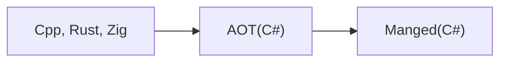

## DevSight.kr
[https://devsight.kr](https://devsight.kr/)

### Software Engineer / Developer
* Language : C#, Rust, Zig, C++, Go
* Database : Oracle, SQL Server, MariaDB, PostgreSQL, Firebird
* Desktop : Avalonia, WPF, Qt, Electrobun, Blazor

### how to post

```md
---
layout: post
title:  "Style Test"
categories: [C#ㆍ.NET Programming]
---

Categories
[Liberal Artsㆍφιλοσοφία]
[DatabaseㆍModeling]
[C#ㆍ.NET Programming]
[C/C++ㆍQTㆍElectron]
[RustㆍZigㆍGo Tutorial]

텍스트

excerpt_separator: <!--more-->

###### 목차는 H6

제목은 yyyy-mm-dd-1.md

유튜브 : 
<div style="position: relative; width: 100%; height: 0; padding-bottom: 56.25%;">
<iframe style="position: absolute; top: 0; left: 0; width: 100%; height: 100%;"
  src="https://www.youtube.com/embed/zF34dRivLOw" frameborder="0" allowfullscreen><
/iframe>
</div>

이미지 : 67 * 2 = 1340

[](https://xxx.yyy/ConfuserEx)

본문인용 :
<blockquote style="border-left:2px solid #e0e0e0; padding-left: 10px; margin-left: 0; ">
인용문구<sup>3</sup>
</blockquote>

> Reference
> 1. 가나다
> 2. 마바사

| A | B | C | D |
|:-:|:-:|:-:|:-:|
| 1 | a | b | c |
| 2 | a | b | c |
| 3 | a | b | c |

Block Mathjax :
$$
f(x) = ax + b
$$

Inline Mathjax : $a \neq b$

---
layout: post
title:  "C#에서 AOT로 NLog사용하기"
categories: [C#ㆍ.NET Programming]
mermaid: true
---
```

<pre><code>

</code></pre>


<center>

</center>

