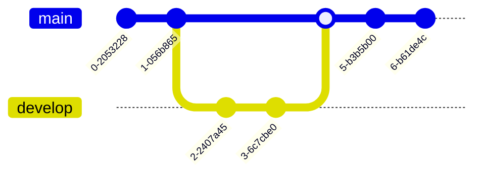

Thank you for visiting our website. Please do not hesitate to contact me with any questions you may have. 프로그램 개발의뢰 및 궁금하신 문의 사항이 있으면 언제든지 메일로 연락해주세요.

###### CONTACT
* **MSJO**™(*DebugJO*) UTC+08:28, DaeHanMinGuk, Corea
* Email : msjo@rustlang.kr

###### SNS(Social Network Service)
* GitHub : [github.com/DebugJO](https://github.com/DebugJO)
* Telegram : @debug [(t.me/debug)](https://t.me/debug)

###### Software Engineer / Developer
* **Programming Language**: C#, Rust, Zig, C++, Go
* **Database**: Oracle, SQL Server, MariaDB, PostgreSQL, Firebird
<br>
###### Geeky Pleasures

<div style="text-align: center;">
 $X_k = \sum_{n=0}^{N-1} x_n \cdot e^{-i \frac{2\pi}{N} kn}$ &nbsp;&nbsp;,&nbsp;&nbsp; $X[k] = E[k] + W_N^k O[k]$ &nbsp;&nbsp;,&nbsp;&nbsp; $y = f(\sum_{i=1}^{n} w_i x_i + b)$
</div>
<br>
###### Philosophical Religion => { NULL }

```cs
foreach (Person person in people) { person.toHappy(); }
```
<br>

